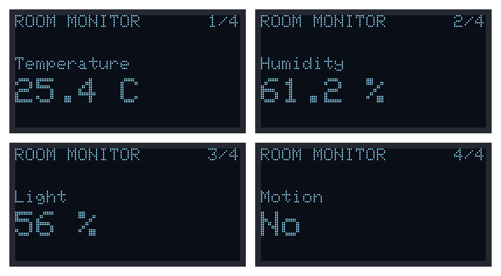
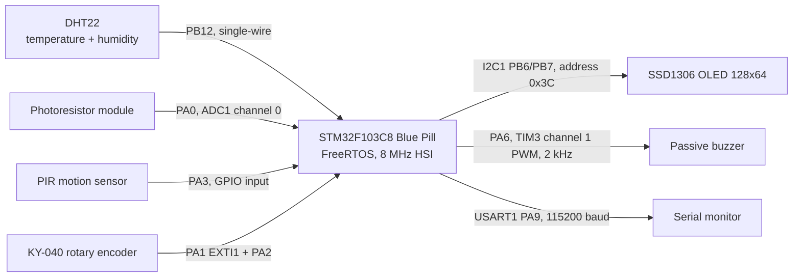
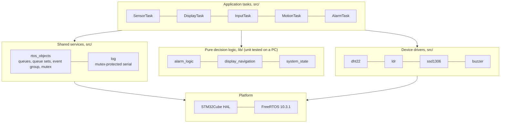
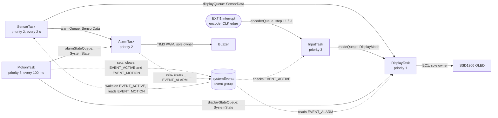
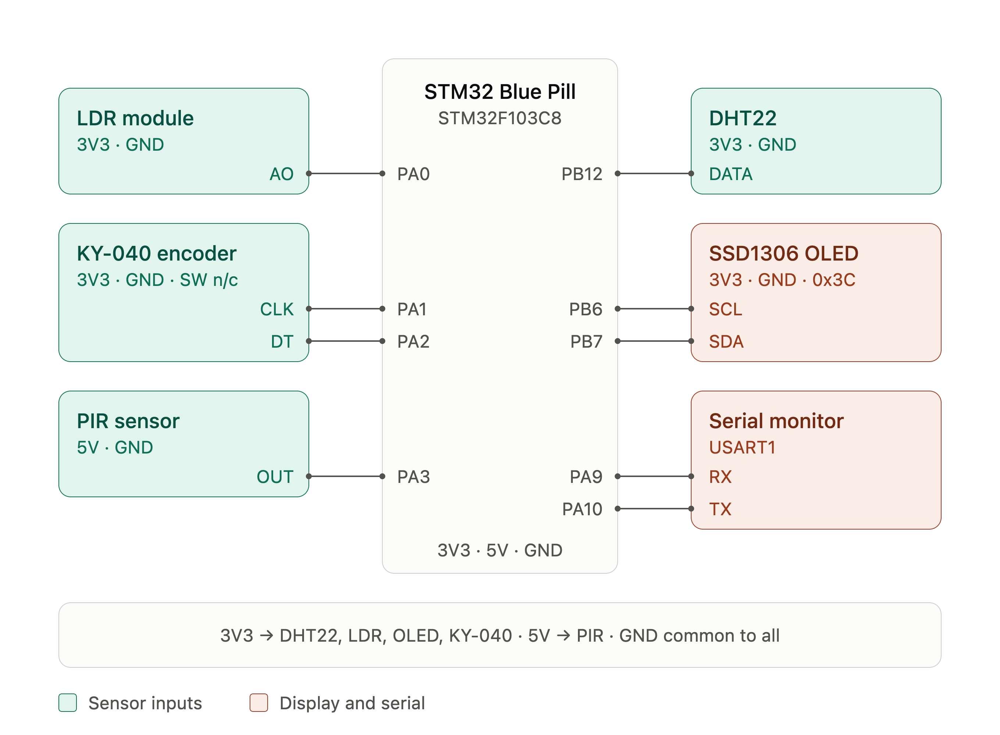
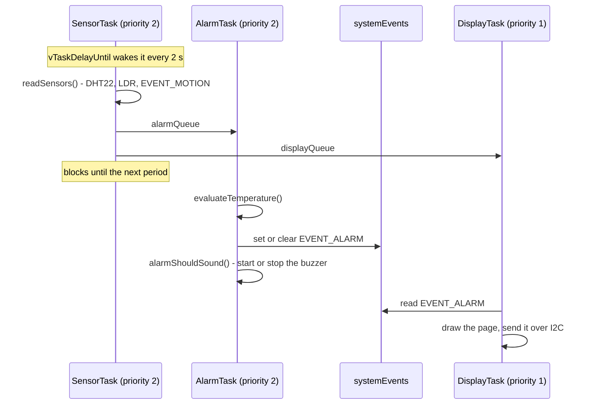
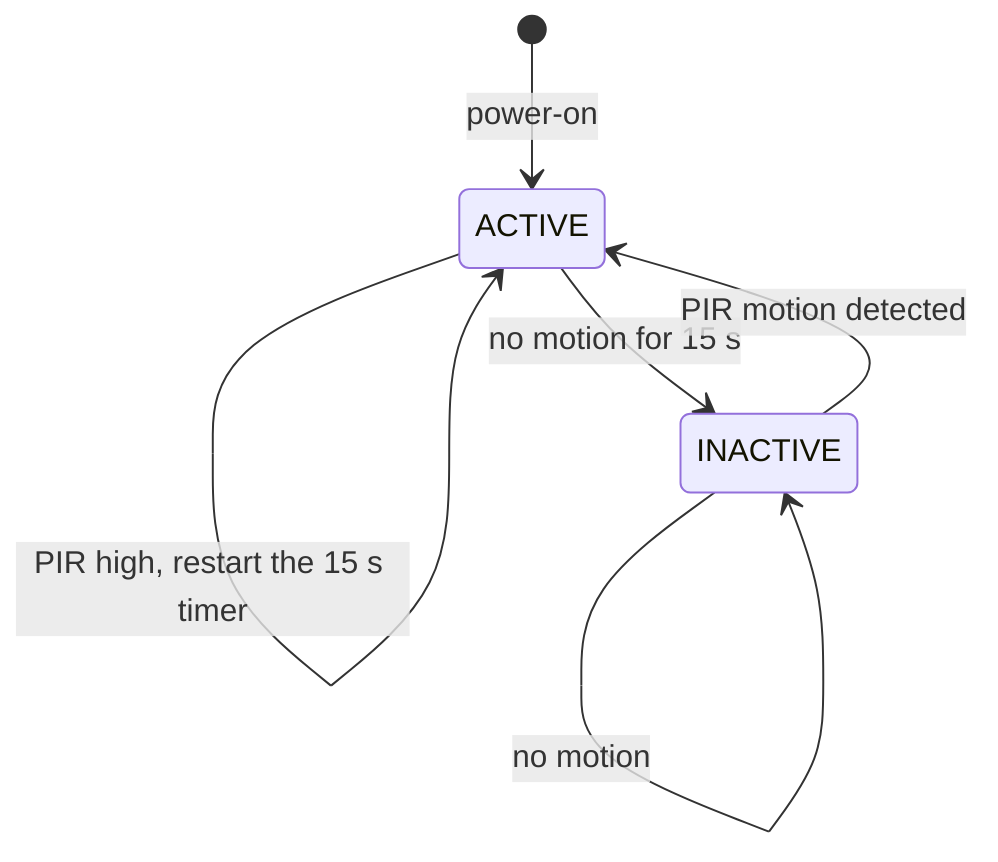
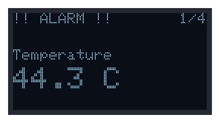
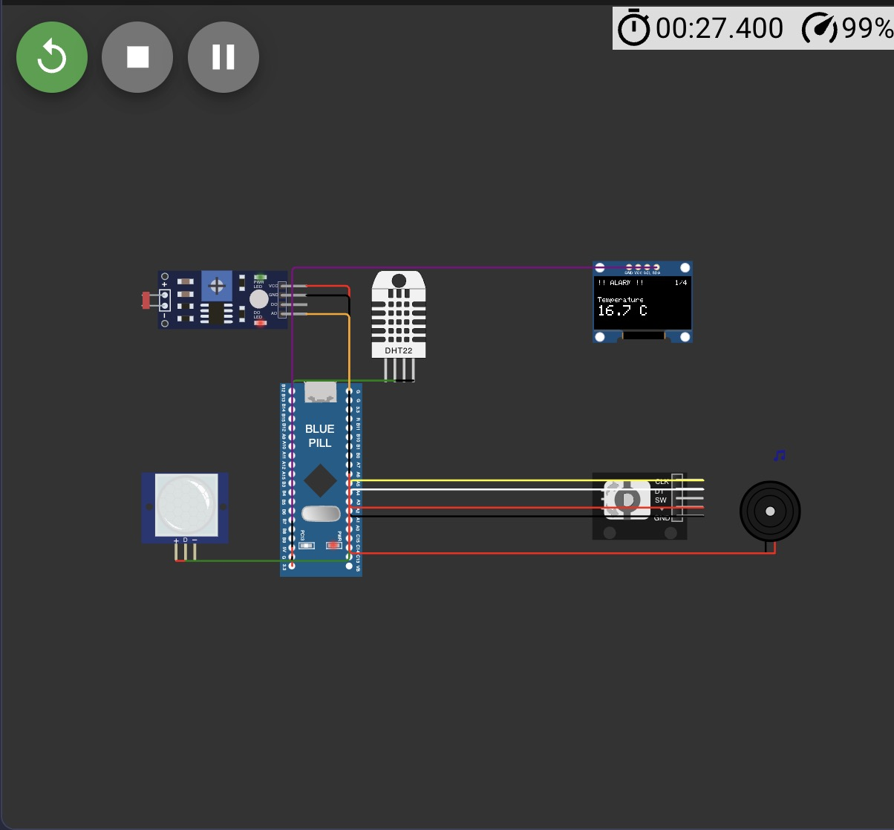

# FreeRTOS Multisensor Room Monitor — STM32 Blue Pill in Wokwi

A room-monitoring device built on the STM32F103C8 "Blue Pill" with the
STM32Cube HAL and native FreeRTOS, simulated in [Wokwi](https://wokwi.com).
It measures temperature, humidity and ambient light, detects motion, shows one
measurement at a time on an OLED selected with a rotary encoder, sounds a
buzzer when the temperature leaves a normal range, and switches its display off
and pauses sensing when the room has been empty for 15 seconds.



*The four display pages, rendered on a PC from the firmware's own SSD1306
drawing code (`src/ssd1306.c` and its font), with the same layout calls as
`DisplayTask`. The number in the top-right corner is the page position that the
rotary encoder moves through.*

---

## Project Overview

The firmware is a concurrent embedded system rather than a single loop: five
FreeRTOS tasks each own one concern (sensing, display, user input, motion and
alarms) and talk to each other only through FreeRTOS queues, queue sets, an
event group and a mutex. There is no Arduino code: peripherals are driven
through the STM32Cube HAL, and the DHT22, photoresistor, SSD1306 and buzzer
drivers are written for this project.

The decisions the system makes (is this temperature an alarm, should the buzzer
sound, which page comes next, should the system go to sleep) are written as pure
functions with no hardware or RTOS dependencies. That keeps them testable on a
PC: 23 unit tests run with `pio test`, without Wokwi or an STM32. `pio check`
(Cppcheck) reports no defects in the project's code.

The project was built as Laboratory Activity 1 of *BCA182 Embedded Systems
Programming* at MSU–Iligan Institute of Technology.

## Features

- **Periodic sensing.** Temperature and humidity from a DHT22, and relative
  ambient light (0–100 %) from a photoresistor on the ADC, every 2 seconds.
- **Motion detection.** PIR sensor sampled 10 times a second.
- **One measurement at a time on an SSD1306 OLED.** Four pages: Temperature,
  Humidity, Light and Motion.
- **Rotary encoder navigation.** Clockwise moves to the next page and
  counterclockwise to the previous one, wrapping around at both ends.
- **Temperature alarm.** Below 18 °C or above 30 °C, a buzzer sounds a 2 kHz
  tone, the OLED title becomes `!! ALARM !!`, and the state is logged. The alarm
  is only active while the system is ACTIVE.
- **ACTIVE / INACTIVE state machine.** After 15 s without motion the OLED turns
  off, sensing pauses, the buzzer is silenced and the encoder is ignored. Motion
  wakes the system again.
- **Timestamped serial log.** Every task logs through one function that holds
  a mutex, so lines never interleave.
- **23 host-side unit tests** covering the alarm, buzzer, navigation and
  state-machine decisions, and a clean static-analysis report.

## Real-World Applications

The same structure (periodic sensing, a single-owner display, event-driven
input, an alarm output and an occupancy-driven power state) is common in
building and environment monitoring. For example:

- **Occupancy-aware room displays** in offices, classrooms and meeting rooms.
  The display and sensing sleep while nobody is there, which saves power and
  reduces OLED burn-in.
- **Thermostat and HVAC front panels.** A rotary encoder paging through
  measurements on a small screen is a typical control-panel interface.
- **Climate watch for closets, storerooms, greenhouses or nurseries.** The
  temperature limits are named constants, so they can be set for the space.
  Such a deployment would keep alarms running while the room is empty, which
  this design deliberately does not (see
  [Engineering Decisions](#engineering-decisions)).
- **Building automation.** The occupancy signal (`EVENT_MOTION` and
  `EVENT_ACTIVE`) is the kind of input used to switch lighting or ventilation.

These are the kinds of product the architecture suits. This project is a
simulation and has not been deployed or measured in any of them.

## Learning Objectives

The project demonstrates:

- creating an STM32Cube project in PlatformIO, and building and simulating its
  circuit in Wokwi;
- interfacing sensors and actuators through GPIO, the ADC, I2C, a timer's PWM
  output and a timing-critical single-wire protocol, using the STM32 HAL;
- organising firmware into modules, and separating hardware-independent
  decision logic from drivers;
- creating FreeRTOS tasks, assigning priorities from scheduling urgency and
  acceptable latency, and telling the Running, Ready and Blocked states apart;
- periodic execution with `vTaskDelayUntil()`;
- inter-task communication with queues and queue sets, event signalling with an
  event group, and protecting a shared resource with a mutex;
- implementing and unit testing a small state machine;
- running static code analysis with PlatformIO and acting on the findings; and
- using Git incrementally.

## System Architecture

### Hardware



*Every peripheral connects directly to the Blue Pill. Inputs arrive four
different ways (single-wire bit timing, analog, polled GPIO and an edge
interrupt). The outputs are the OLED, the buzzer and the serial log.*

### Software layers



*Tasks sit on top of three kinds of code. The decision logic in `lib/` has no
hardware or RTOS dependencies, which is what lets it build and run on a PC for
unit testing. Only the drivers and shared services touch the HAL and the
kernel.*

## FreeRTOS Architecture



*Solid arrows carry data through queues; dotted arrows are event-group bits.
`DisplayTask` and `AlarmTask` each wait on a queue set that combines their
queues. Every task also writes the serial log through `logPrintf`, which holds
`serialMutex` while it transmits (not drawn).*

Every FreeRTOS mechanism the lab requires has a job in the design:

| Concept | Where it is used |
|---|---|
| Multiple tasks, explicit priorities | Five application tasks, priorities 1–3, set and justified in `src/main.cpp` |
| Blocking delays | Every task blocks on a delay, a queue, a queue set or an event bit. None busy-waits between jobs. |
| `vTaskDelayUntil()` | `SensorTask` (2 s period) and `MotionTask` (100 ms period) |
| Queues | Sensor readings to two consumers, encoder steps from an interrupt, page changes and state changes |
| Queue sets | `DisplayTask` waits on readings, page and state changes at once; `AlarmTask` waits on readings and state changes |
| Mutex | `serialMutex` serialises the shared USART1 log |
| Event group | `EVENT_ACTIVE`, `EVENT_MOTION` and `EVENT_ALARM`, broadcast to several tasks |
| State machine | ACTIVE / INACTIVE, decided by `evaluateSystemState()` |

## Hardware / Simulated Components

| Component | Wokwi part | Purpose |
|---|---|---|
| STM32 Blue Pill (STM32F103C8) | `board-stm32-bluepill` | Main microcontroller: Cortex-M3, 64 KB flash, 20 KB RAM |
| DHT22 | `wokwi-dht22` | Temperature (0.1 °C resolution) and relative humidity |
| Photoresistor module | `wokwi-photoresistor-sensor` | Ambient light as an analog voltage |
| PIR motion sensor | `wokwi-pir-motion-sensor` | Motion detection |
| KY-040 rotary encoder | `wokwi-ky-040` | Page navigation |
| SSD1306 OLED, 128×64, I2C | `board-ssd1306` | Shows one measurement at a time |
| Passive buzzer | `wokwi-buzzer` (volume 0.1) | Temperature alarm output. A passive buzzer only sounds while its input switches, so it is driven with a square wave. |



*Wiring of the sensors, OLED and serial monitor to the Blue Pill, as built in
Wokwi (`diagram.json`). Sensor inputs are green; the display and serial link
are red. The buzzer on PA6 is listed in the pin table below.*

## Pin Configuration

| Blue Pill pin | Connected to | Peripheral / mode |
|---|---|---|
| PB12 | DHT22 SDA | GPIO: output while sending the start signal, input with pull-up to read |
| PA0 | Photoresistor AO | ADC1 channel 0, 12-bit |
| PA3 | PIR OUT | GPIO input, pull-down |
| PA1 | Encoder CLK | GPIO input, pull-up, EXTI1 falling-edge interrupt |
| PA2 | Encoder DT | GPIO input, pull-up |
| PA6 | Buzzer + (pin 2) | TIM3 channel 1, PWM 2 kHz, 50 % duty; buzzer − (pin 1) to GND |
| PB6 / PB7 | OLED SCL / SDA | I2C1, 400 kHz, address 0x3C |
| PA9 / PA10 | Serial monitor | USART1 TX / RX, 115200 baud |
| 3V3 | DHT22, photoresistor, OLED, encoder | The photoresistor runs from 3.3 V because PA0 is not 5 V tolerant |
| 5V | PIR | A real HC-SR501 needs 4.5 V or more; its output is 3.3 V |

The system clock is the internal 8 MHz oscillator (HSI) with no dividers, so
the CPU, both peripheral buses and TIM3 all run at 8 MHz.

## Task Design

| Task | Responsibility | Trigger / period | Priority | Communication | Usually blocked on |
|---|---|---|---|---|---|
| `MotionTask` | Samples the PIR, owns the ACTIVE / INACTIVE state | Every 100 ms (`vTaskDelayUntil`) | 3 | Publishes to the event group, `displayStateQueue` and `alarmStateQueue` | Its next period |
| `InputTask` | Turns encoder steps into page changes | Each encoder step | 3 | Receives from `encoderQueue`, overwrites `modeQueue` | `encoderQueue` |
| `SensorTask` | Reads the DHT22 and LDR, sends each reading to both consumers | Every 2 s (`vTaskDelayUntil`) | 2 | Sends to `alarmQueue` and `displayQueue` | Its next period, or `EVENT_ACTIVE` while INACTIVE |
| `AlarmTask` | Evaluates each reading, owns the buzzer | Each reading or state change | 2 | Waits on the `alarmEvents` queue set, sets or clears `EVENT_ALARM` | `alarmEvents` |
| `DisplayTask` | Owns the OLED: draws the selected page, turns the panel off while INACTIVE | Each reading, page change or state change | 1 | Waits on the `displayEvents` queue set | `displayEvents` |
| `ProcessingTask` | Placeholder workload from an exercise on avoiding busy loops | Bounded batch, then a 200 ms delay | 2 | Serial log only | `vTaskDelay` |

Each task has a 256-word (1 KB) stack. The FreeRTOS heap is 13 KB, and the
build uses about 15 KB of the 20 KB of RAM.

**Why these priorities.** Each priority reflects how quickly a task must
respond, how much delay it can tolerate, and how long its own work holds up
the tasks below it. Importance alone doesn't set it.

- **Priority 3.** `MotionTask` wakes the system, and a late sample leaves the
  display dark after someone walks in. `InputTask` should turn a knob click into
  a page change within about 100 ms. Both do microseconds of work per event, so
  running them first costs the other tasks almost nothing.
- **Priority 2.** `SensorTask` runs every 2 s, so a few milliseconds of start
  jitter is harmless. Its microsecond-timed DHT22 read is protected by suspending
  the scheduler, not by its priority. `AlarmTask` gets a reading every 2 s, so
  starting or stopping the buzzer within a fraction of a second is plenty. It
  must outrank `DisplayTask`, so that `EVENT_ALARM` is up to date before a
  reading is drawn.
- **Priority 1.** `DisplayTask` has the loosest deadline, since a person
  reading the screen won't notice tens of milliseconds. Each screen update also
  busy-waits on I2C (about 25 ms on hardware, about 160 ms in Wokwi), so at the
  bottom it can never delay the tasks above.

If the priorities were inverted, for example with `DisplayTask` above
`MotionTask` and `InputTask`, every 160 ms screen update in Wokwi would delay
motion sampling and encoder handling by the same amount.

## Inter-Task Communication

### Queues and queue sets

| Queue | Item | Length | From → to | Why this shape |
|---|---|---|---|---|
| `alarmQueue` | `SensorData` | 4 | `SensorTask` → `AlarmTask` | One queue per consumer. A FreeRTOS queue gives each item to exactly one receiver, so two consumers sharing a queue would each see only some of the readings. |
| `displayQueue` | `SensorData` | 4 | `SensorTask` → `DisplayTask` | Same. `SensorTask` sends with a zero timeout, so a stalled consumer misses a reading instead of making the sensor late. |
| `encoderQueue` | `int8_t` step | 8 | EXTI1 interrupt → `InputTask` | Keeps the interrupt handler tiny: it reads DT, queues +1 or −1, and returns. |
| `modeQueue` | `DisplayMode` | 1, overwritten | `InputTask` → `DisplayTask` | Only the latest page matters, never a backlog. |
| `displayStateQueue` | `SystemState` | 1, overwritten | `MotionTask` → `DisplayTask` | Wakes `DisplayTask` to switch the panel off or on. |
| `alarmStateQueue` | `SystemState` | 1, overwritten | `MotionTask` → `AlarmTask` | Wakes `AlarmTask` to silence the buzzer the moment the system goes INACTIVE, without waiting for a reading. |

A queue set lets a task block on several queues and wake for whichever has data
first, without polling. `DisplayTask` blocks on **`displayEvents`**
(`displayQueue`, `modeQueue` and `displayStateQueue`). `AlarmTask` blocks on
**`alarmEvents`** (`alarmQueue` and `alarmStateQueue`).

### One sampling period



*`AlarmTask` has the higher priority of the two consumers, so it has updated
`EVENT_ALARM` before `DisplayTask` draws the same reading, and the alarm banner
always matches the value on screen.*

### Event group bits (`systemEvents`)

| Bit | Meaning | Producer | Set when | Cleared when | Consumers |
|---|---|---|---|---|---|
| `EVENT_ACTIVE` (0) | The system is ACTIVE | `MotionTask` | At start-up, and when motion ends INACTIVE | The inactivity timeout starts INACTIVE | `SensorTask` waits on it; `InputTask` ignores steps while it is clear |
| `EVENT_MOTION` (1) | The PIR output is high | `MotionTask` | A sample finds the PIR high | A sample finds it low | `SensorTask` copies it into `SensorData.motionDetected`, so only `MotionTask` reads the PIR pin |
| `EVENT_ALARM` (2) | The last evaluated reading is out of range | `AlarmTask` | A reading evaluates to LOW or HIGH | A reading evaluates to NORMAL | `DisplayTask` shows the `!! ALARM !!` banner |

An event group suits these because they are *states* several tasks need to
read, not messages to be consumed once.

### Mutex: the shared serial port

The shared resource is **USART1**. Every task that logs (all five application
tasks and `ProcessingTask`) competes for it. The failure the mutex prevents: a
higher-priority task preempts another in the middle of a line, finds the UART
busy, and its own line is lost or mixed into the other one.

`logPrintf` formats the whole line first, then holds `serialMutex` only while
the bytes go out (at most about 7 ms per line). A mutex is used rather than a
binary semaphore because of **priority inheritance**. While `InputTask`
(priority 3) waits for a line from `DisplayTask` (priority 1), `DisplayTask`
temporarily runs at priority 3. Otherwise `SensorTask` or `ProcessingTask`
(priority 2) could preempt it and stretch the wait.

The OLED and the buzzer need no mutex, because each has exactly one owner:
`DisplayTask` and `AlarmTask` respectively.

## State Machine



*`MotionTask` samples the PIR every 100 ms and passes the result to
`evaluateSystemState()`, which decides the transition. The timer counts from the
last sample that found the PIR output high.*

| | ACTIVE | INACTIVE |
|---|---|---|
| OLED | On; redrawn on each reading, page change or alarm | Off (SSD1306 sleep command); nothing is drawn |
| Sensor processing | DHT22 and LDR read every 2 s | Paused: `SensorTask` blocks on `EVENT_ACTIVE` |
| Encoder | Changes pages | Steps are ignored and logged |
| Alarm | Every reading is evaluated; the buzzer sounds while a reading is out of range | Buzzer silenced as soon as INACTIVE starts; no readings arrive to evaluate |
| Motion detection | Sampled every 100 ms | Sampled every 100 ms; motion returns the system to ACTIVE |

## How It Works — Algorithms

**Drift-free periodic sampling.** `SensorTask` uses `vTaskDelayUntil()`, which
wakes the task at fixed multiples of 2 s measured from the previous wake time.
`vTaskDelay(2000)` would instead count from when the reads *finished*. The read
time (the DHT22 alone takes about 8 ms), and any time spent preempted, would then
add to every period, and the samples would drift later and later. With
`vTaskDelayUntil()`, one slow read does not shift the samples after it.

**DHT22 decoding** (`src/dht22.c`):

1. The task holds the line low for 2–3 ms using `vTaskDelay`, so it blocks
   instead of spinning.
2. The DHT22 then answers with 40 bits. Each bit is a 50 µs low followed by a
   high that lasts 26–28 µs for a 0 or 70 µs for a 1.
3. Instead of timing pulses with a timer, the driver counts polling-loop passes
   during each low and each high. A bit is a 1 if its high lasted longer than
   the 50 µs low before it. Comparing the two counts works at any CPU clock and
   needs no timer.
4. The scheduler is suspended for the roughly 5 ms reply so no task can
   interrupt it. Suspending the scheduler is used instead of disabling
   interrupts, which Wokwi ignores.
5. A checksum byte then validates the frame.

**Relative light level** (`src/ldr.c`). More light lowers the photoresistor's
resistance, which lowers the module's output voltage. A 12-bit reading becomes
`light % = round(100 × (4095 − raw) / 4095)`: 0 % is dark and 100 % is bright.
This is deliberately *not* lux. Lux would need the module's fixed resistor value
and the LDR's resistance curve, or a calibration against a lux meter.

**Alarm evaluation** (`lib/alarm_logic`). `evaluateTemperature()` returns
`LOW_TEMPERATURE` below 18.0 °C, `HIGH_TEMPERATURE` above 30.0 °C, and `NORMAL`
from 18.0 to 30.0 inclusive. `alarmShouldSound()` then adds the ACTIVE rule:
the buzzer sounds only for LOW or HIGH, and only while the system is ACTIVE. A
failed DHT22 read carries no temperature, so the alarm keeps its last state
rather than being cleared.

**Buzzer tone** (`src/buzzer.c`). TIM3 counts at 8 MHz. A prescaler of 8 gives
1 MHz ticks, a period of 500 ticks gives 2 kHz, and a compare value of 250
gives a 50 % square wave on PA6. Stopping the channel holds the pin low, which
is silent.

**Page navigation** (`lib/display_navigation`). The pages are an `enum class`
in the order Temperature, Humidity, Light, Motion. The next page is
`(index + 1) mod 4`. The previous page is `(index + 3) mod 4`, which avoids a
negative intermediate value.

**Encoder decoding** (`src/input.cpp`). CLK falls once per detent. At that
moment DT high means clockwise and DT low means counterclockwise.

**Inactivity state machine** (`lib/system_state`). Motion always gives ACTIVE.
Without motion, ACTIVE becomes INACTIVE once 15 s have passed since the PIR was
last seen high. INACTIVE stays INACTIVE until motion.

**OLED rendering** (`src/ssd1306.c`). Text is drawn into a 1 KB copy of the
screen in RAM using a 5×7 font. Values are drawn at double size. The whole
screen is then sent over I2C in one transfer.

## Repository Structure

```
freertos-multisensor-project/                repository root
├── README.md
├── docs/images/                             figures used in this README
└── freertos-multisensor-project/            PlatformIO project
    ├── platformio.ini                       bluepill_f103c8 (firmware) and native (unit tests)
    ├── extra_script.py                      builds FreeRTOS from STM32CubeF1 with the ARM_CM0 port
    ├── native_env.py                        lets a plain `pio run` skip the test-only native env
    ├── diagram.json                         Wokwi circuit
    ├── wokwi.toml                           Wokwi firmware paths
    ├── include/
    │   ├── FreeRTOSConfig.h
    │   ├── rtos_objects.h                   shared queues, queue sets, event bits (documented), mutex
    │   ├── sensors.h, display.h, input.h, alarm.h, motion.h
    │   ├── log.h, demo_tasks.h
    │   └── dht22.h, ldr.h, ssd1306.h, buzzer.h   device drivers
    ├── src/
    │   ├── main.cpp                         main() → app_main(): hardware, RTOS objects, tasks, scheduler
    │   ├── rtos_objects.cpp                 creates the shared FreeRTOS objects
    │   ├── sensors.cpp                      SensorTask
    │   ├── display.cpp                      DisplayTask
    │   ├── input.cpp                        InputTask and the encoder interrupt
    │   ├── alarm.cpp                        AlarmTask
    │   ├── motion.cpp                       MotionTask and the system state
    │   ├── log.cpp                          USART1 and mutex-protected logPrintf
    │   ├── demo_tasks.cpp                   ProcessingTask (busy-loop exercise)
    │   ├── dht22.c, ldr.c, ssd1306.c, buzzer.c, font5x7.h
    │   └── wokwi_port_fixes.c               FreeRTOS port workarounds for Wokwi's CPU model
    ├── lib/                                 hardware-independent logic, built for both targets
    │   ├── alarm_logic/                     evaluateTemperature(), alarmShouldSound()
    │   ├── display_navigation/              nextDisplayMode(), previousDisplayMode()
    │   └── system_state/                    evaluateSystemState()
    └── test/
        ├── test_alarm_logic/
        ├── test_display_navigation/
        └── test_system_state/
```

The layout follows the lab's suggested module list, with three changes. The
system-state logic lives in `lib/system_state/`, next to `lib/alarm_logic/` and
`lib/display_navigation/`, because PlatformIO can build `lib/` on a PC for unit
tests but not `src/`, which includes the STM32 HAL. Serial output has its own
`log` module because every task uses it. The busy-loop exercise task lives in
`demo_tasks`, away from the application modules.

## Getting Started

You need:

- [Visual Studio Code](https://code.visualstudio.com/) with the
  [PlatformIO IDE](https://platformio.org/install/ide?install=vscode) extension
- the [Wokwi for VS Code](https://docs.wokwi.com/vscode/getting-started)
  extension and a Wokwi license (the extension explains how to get one)
- Git

Check the tools, then clone:

```sh
git --version
pio --version
git clone https://github.com/TristanListanco/freertos-multisensor-project.git
cd freertos-multisensor-project/freertos-multisensor-project
```

Open the inner `freertos-multisensor-project` folder in VS Code; that is where
`platformio.ini` is.

## Building the Project

```sh
pio run
```

This builds the firmware (`bluepill_f103c8`) and writes
`.pio/build/bluepill_f103c8/firmware.bin` and `firmware.elf`, which Wokwi loads.
The `native` environment reports success without building anything, because it
exists only for unit tests. At the time of writing the firmware uses 21,708 of
65,536 bytes of flash (33.1 %) and 15,148 of 20,480 bytes of RAM (74.0 %).

`extra_script.py` compiles the FreeRTOS kernel that ships with the
STM32CubeF1 framework, and routes the kernel's yield through the Wokwi
workaround described in [Engineering Decisions](#engineering-decisions).

## Running the Wokwi Simulation

1. Build with `pio run`.
2. In VS Code, run **Wokwi: Start Simulator** from the Command Palette.
3. Keep the simulator tab visible; the simulation pauses while it is hidden.
4. Watch the serial monitor, and click the parts to change their inputs: the
   DHT22's temperature and humidity, the photoresistor's light level, the PIR's
   motion trigger, and the encoder knob.

An excerpt of the serial output from a simulator run (some `Processing` lines
removed):

```
BCA182 FreeRTOS Multisensor
System starting...
[     0 ms] Motion: ACTIVE, timeout 15 s
[    17 ms] Alarm #1: 44.3 C -> HIGH_TEMPERATURE
[   345 ms] Display #1: 44.30 C, 61.20 %RH, light 56 %, motion no
[   830 ms] Processing: batch #5 took 3 ms, result e915c669
[  2016 ms] Alarm #2: 44.3 C -> HIGH_TEMPERATURE
[  2023 ms] Display #2: 44.30 C, 61.20 %RH, light 56 %, motion no
...
[ 14016 ms] Alarm #8: 44.3 C -> HIGH_TEMPERATURE
[ 14023 ms] Display #8: 44.30 C, 61.20 %RH, light 56 %, motion no
[ 15000 ms] Motion: INACTIVE (inactivity timeout)
```

*The DHT22 had been set to 44.3 °C, so every reading evaluates to
`HIGH_TEMPERATURE`. The first `Display` line comes later than the rest because
`DisplayTask` first starts the OLED and clears it. With no motion, the system
goes INACTIVE exactly 15 s after start-up and the readings stop. This run was
captured before the buzzer was added. The current firmware also logs
`Alarm: buzzer on` after the first out-of-range reading, and `Alarm: buzzer off`
when the system goes INACTIVE or the temperature returns to normal.*

Turning the encoder logs lines such as `Input: clockwise, page Humidity`, or
`Input: ignored, system INACTIVE` while the display is off.



*With the temperature above 30 °C, the title line becomes `!! ALARM !!`
(rendered from the firmware's drawing code, as in the first figure).*



*Serial log from a longer Wokwi run, captured before the buzzer was added. At
59.4 °C every reading evaluates to `HIGH_TEMPERATURE`. The PIR reports motion at
23 s (`motion yes`), a clockwise encoder step selects the Light page at 33.7 s,
the light level changes from 21 % to 94 %, and the system goes INACTIVE at
38.9 s after 15 s without motion.*

## Unit Testing

```sh
pio test
```

The tests use PlatformIO's Unity framework and run on the PC in the `native`
environment. They cover only the decision logic in `lib/`, which has no
hardware dependencies. The firmware environment is set to ignore them
(`test_ignore = *`), since PlatformIO has no Unity runner for STM32Cube and
on-target tests would need a physical board.

| Suite | Tests | What it covers |
|---|---|---|
| `test_alarm_logic` | 11 | Below the lower limit (17.9), exactly the lower limit (18.0), a normal value (25.4), exactly the upper limit (30.0), above the upper limit (30.1), the DHT22's range extremes, limit values built the way the firmware builds them (`tenths / 10.0f`), and the buzzer rule: sounds for LOW and HIGH while ACTIVE, silent for NORMAL, silent for every state while INACTIVE, and a hot reading that sounds only while ACTIVE |
| `test_display_navigation` | 6 | Forward steps, reverse steps, wraparound in both directions, next and previous undoing each other on every page, and a full clockwise cycle in the required order |
| `test_system_state` | 6 | ACTIVE without timeout, ACTIVE at the timeout, INACTIVE without motion, INACTIVE with motion, ACTIVE with motion, and a replayed 30 s timeline that must go INACTIVE exactly 15 s after the last motion |

The assertions compare enum values directly, and a failure message names the
state that was actually returned. To check the tests can catch real mistakes,
eight realistic bugs were planted one at a time in a copy of the code, and each
one made at least one test fail. Examples: treating exactly 30.0 °C as HIGH,
making the timeout fire 1 ms late, letting the buzzer sound while INACTIVE, and
sounding the buzzer only for HIGH but not LOW.

## Static Code Analysis

```sh
pio check
```

PlatformIO runs Cppcheck with its warning, style, performance, portability and
unused-function checks. The firmware environment analyses everything built into
the firmware (`include/`, `src/` and `lib/`) with the STM32 headers. The native
environment analyses the unit tests (`test/`).

**Result: no defects found in either environment.** The first run reported 67
findings, all of low severity (style), and none of high or medium severity. The
same findings appeared twice, once per environment. They were resolved as
follows (line numbers as first reported):

| Finding | File/Line | Cause | Resolution |
|---|---|---|---|
| `unusedFunction` — "function is never used" (29 functions, e.g. `SensorTask`, `logPrintf`, `buzzerInit`) | `sensors.cpp:64`, `log.cpp:61`, `buzzer.c:15` and 26 others | False positive. PlatformIO runs Cppcheck on one file at a time, so it cannot see calls between files. Every flagged function was checked and has a caller in another module. `PendSV_Handler` is called from the vector table, and `__wrap_vPortYield` is reached through the linker's `--wrap` option. | Suppressed for the project (`--suppress=unusedFunction` in `platformio.ini`), with the reason recorded there |
| `clarifyCalculation` — precedence of `&` and `?:` | `dht22.c:44` | `IDR & PIN ? 1 : 0` is correct, because `&` binds tighter than `?:`, but it is easy to misread in a timing-critical loop | Parenthesised as `(IDR & PIN) != 0u ? 1u : 0u`. The generated machine code is identical, so the DHT22 timing is unchanged. |
| `cstyleCast` — C-style pointer cast | `log.cpp:49`, `log.cpp:77` | `(uint8_t *)` casts that also threw away `const`, although `HAL_UART_Transmit` accepts `const uint8_t *` | Replaced with `reinterpret_cast<const uint8_t *>`, which keeps the `const` |
| `cstyleCast` — C-style pointer cast | `log.cpp:78`, `input.cpp:67` | The casts are inside FreeRTOS's `xSemaphoreGive` and `portYIELD_FROM_ISR` macros, which are third-party code | Suppressed on those two lines with a comment naming the macro |
| `constParameterPointer` — parameter could be a pointer to const | `log.cpp:25` | `HAL_UART_MspInit` overrides HAL's weak function of the same name, so its signature must match HAL's exactly | Suppressed on that line with a comment explaining why |
| Every finding reported twice | both environments | The native environment was analysing `src/` with host headers, where the STM32 code does not belong | Scoped the analysis: firmware sources in `bluepill_f103c8`, unit tests in `native` |

To confirm the narrower scope still checks everything, a deliberate defect (an
uninitialised variable) was planted in `src/`, `lib/` and `test/` of a scratch
copy. `pio check` reported all three as high-severity errors.

## Functional Verification

Run these in the Wokwi simulator. Evidence for each comes from the OLED, the
buzzer and the serial log.

| ID | Stimulus | Expected result | Where to observe it |
|---|---|---|---|
| FT-01 | Change the DHT22 temperature | Displayed temperature updates | Temperature page; `Display #n` line within 2 s |
| FT-02 | Change the DHT22 humidity | Displayed humidity updates | Humidity page; `Display #n` line |
| FT-03 | Change the photoresistor's light level | Light value changes | Light page; `light n %` in the `Display #n` line |
| FT-04 | Rotate the encoder clockwise | Next page is selected | OLED page and position; `Input: clockwise, page …` |
| FT-05 | Rotate the encoder counterclockwise | Previous page is selected | OLED page and position; `Input: counterclockwise, page …` |
| FT-06 | Set the temperature above 30 °C | Alarm activates | Buzzer tone; `!! ALARM !!` title; `-> HIGH_TEMPERATURE` then `Alarm: buzzer on` |
| FT-07 | Return the temperature to 18–30 °C | Alarm stops | Tone stops; title back to `ROOM MONITOR`; `-> NORMAL` then `Alarm: buzzer off` |
| FT-08 | Trigger the PIR | System is ACTIVE | Motion page shows `Yes`; timer restarts |
| FT-09 | Leave the PIR untouched for 15 s | System becomes INACTIVE | OLED goes dark and any tone stops; `Motion: INACTIVE (inactivity timeout)` |
| FT-10 | Trigger the PIR while INACTIVE | System returns to ACTIVE | OLED comes back; `Motion: ACTIVE (motion detected)` |

## Engineering Decisions

- **One queue per consumer.** The lab's diagram shows one "Sensor Queue"
  feeding two tasks. A FreeRTOS queue delivers each item to a single receiver,
  so each reading is copied into one queue per consumer. State changes follow
  the same rule: `displayStateQueue` and `alarmStateQueue`.
- **Queue sets instead of polling.** `DisplayTask` has three reasons to redraw,
  and `AlarmTask` two reasons to act. A queue set lets each block on all of its
  queues at once. That is how `AlarmTask` silences the buzzer the moment the
  system goes INACTIVE, rather than at the next reading, which never comes.
- **One owner per output device.** Only `DisplayTask` touches the OLED, and only
  `AlarmTask` switches the buzzer. That makes the drivers' lack of locking safe
  by design, rather than by a mutex.
- **Event bits for states, queues for data.** ACTIVE, motion and alarm are
  states that several tasks read. Readings and page changes are messages that
  one task consumes.
- **`MotionTask` owns the system state**, instead of a separate `StateTask`.
  The state changes only on PIR samples and elapsed time, both of which
  `MotionTask` already has. The decision itself is the pure
  `evaluateSystemState()`, so it is still separated and tested.
- **INACTIVE pauses sensing and the alarm.** This follows the lab: only motion
  detection keeps running while INACTIVE. A deployment that must alarm in an
  empty room would keep `SensorTask` and `AlarmTask` running and only turn off
  the display.
- **Decision logic in `lib/`.** Pure functions are built both into the firmware
  and into a PC test program, so the firmware runs exactly the code the tests
  exercise.
- **`pio run` and `pio test` each do one job.** Both environments are
  defaults. The firmware environment ignores the tests, and `native_env.py`
  makes the test-only `native` environment finish successfully under a plain
  `pio run`, which would otherwise fail with "Nothing to build".
- **`main()` calls `app_main()`.** The lab handout names `app_main()` as the
  application entry point, which is ESP-IDF's convention, where the framework
  calls it. With STM32Cube, the startup code calls `main()` after reset, so
  `main()` only resets the HAL and hands over to `app_main()`. `app_main()` then
  runs hardware initialisation, FreeRTOS object creation, task creation and the
  scheduler. The handout's mention of "ESP-IDF" in the PlatformIO configuration
  is the same leftover: the project uses `framework = stm32cube`, exactly as the
  handout's own minimum configuration shows.
- **Adapting FreeRTOS to Wokwi's CPU model.** Wokwi's Blue Pill differs from a
  real Cortex-M3 in three ways that break the stock FreeRTOS Cortex-M3 port:
  `svc` does nothing, masking interrupts through PRIMASK has no effect, and
  pending an exception from task code re-runs the pending store forever. The
  project therefore uses FreeRTOS's Cortex-M0 port, which runs unchanged on an
  M3 and starts the first task without `svc`. It also wraps `vPortYield`, with a
  matching PendSV handler that steps past the store (`src/wokwi_port_fixes.c`).
- **Clock setup that works in Wokwi.** Wokwi's clock model never reports the
  internal oscillator as ready. So a HAL request to *select* it fails, and on its
  way out leaves both peripheral buses at ÷16. That dropped the I2C clock to
  500 kHz, below the 4 MHz minimum for 400 kHz I2C, and the OLED never started.
  The chip already runs from that oscillator after reset, so `SystemClock_Config`
  now sets only the bus dividers, and a failure is reported at boot instead of
  passing silently.

## Limitations

- **Light is relative, not lux** (see the light-level algorithm above).
- **The buzzer is driven straight from PA6.** That is fine in Wokwi, but a real
  buzzer should be switched through a transistor rather than loading the GPIO
  pin. The alarm is also a single continuous tone.
- **Encoder decoding reads one edge and does not debounce.** That is reliable
  with Wokwi's clean signals, but a real KY-040 bounces and would produce extra
  steps.
- **Critical sections aren't atomic in Wokwi**, because its CPU model ignores
  PRIMASK. On real hardware they are.
- **OLED transfers busy-wait.** Each update ties up the CPU for about 25 ms on
  hardware, and about 160 ms in Wokwi, whose I2C is slower. It runs at the
  lowest priority, so nothing else waits on it.
- **No hysteresis on the alarm limits.** A noisy reading sitting right at 18.0
  or 30.0 °C could toggle the alarm and the buzzer.
- **No stack-overflow checking or watchdog.** Stack sizes are estimates.
- **`ProcessingTask` is a placeholder** from an exercise on avoiding busy loops,
  not real signal processing.

## Future Improvements

- Drive the buzzer through a transistor on real hardware, and use an
  intermittent beep pattern instead of a continuous tone.
- Decode the encoder with a full quadrature state machine that ignores bounce,
  and use its push button (for example, to adjust the temperature limits).
- Add hysteresis to the alarm limits.
- Move OLED transfers to interrupt-driven I2C so the CPU is free during screen
  updates.
- Enable `configCHECK_FOR_STACK_OVERFLOW`, report each task's stack high-water
  mark, and add the independent watchdog on real hardware.
- On real hardware, run at 72 MHz from the 8 MHz crystal and PLL, and use
  tickless idle to save power while INACTIVE.

## References and Acknowledgments

- *BCA182 Embedded Systems Programming — Laboratory Activity 1: Real-Time
  Multisensor Room Monitoring System*, Asst. Prof. Paul Rodolf P. Castor, M.Sc.,
  MSU–Iligan Institute of Technology, September 2026.
- [FreeRTOS kernel documentation](https://www.freertos.org/); the kernel
  (v10.3.1) comes from STM32CubeF1's middleware.
- STMicroelectronics, *RM0008 Reference Manual* (STM32F101xx–STM32F107xx) and the
  STM32CubeF1 HAL.
- Aosong, *AM2302 / DHT22 datasheet*; Solomon Systech, *SSD1306 datasheet*.
- The 5×7 font in `src/font5x7.h` is the classic 5×7 glyph set, as distributed in
  `glcdfont.c` of the [Adafruit GFX Library](https://github.com/adafruit/Adafruit-GFX-Library)
  (BSD license).
- [Wokwi documentation](https://docs.wokwi.com/), the
  [PlatformIO documentation](https://docs.platformio.org/),
  [Cppcheck](https://cppcheck.sourceforge.io/), and the
  [Unity](https://www.throwtheswitch.org/unity) test framework.

Author: Tristan Listanco.
